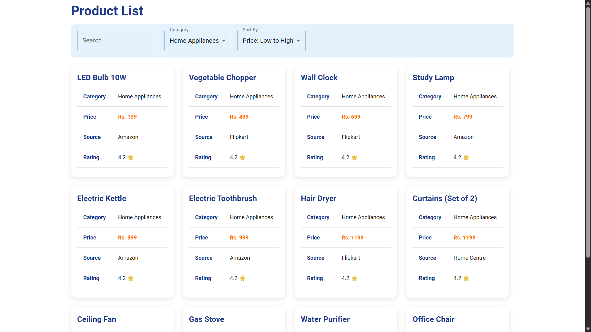
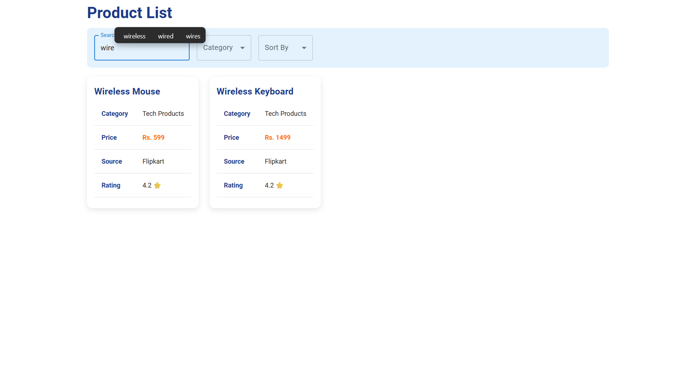
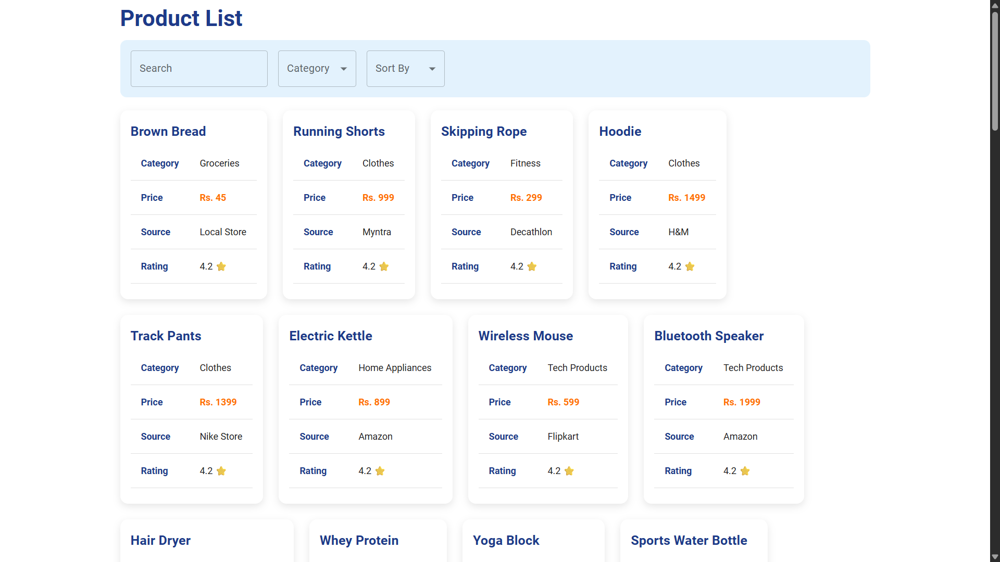

# PricePilot

**PricePilot** is a full-stack web application for comparing product prices across categories, built using React (with Vite), Spring Boot, and MongoDB. It offers a professional, clean UI with category filtering, search, and sorting, and does **not** require user login.


---

## 🚀 Tech Stack

### Frontend:

* **React** (with Vite)
* **Axios** – API requests
* **Bootstrap & Material UI** – Styling and layout

### Backend:

* **Spring Boot** (Java)
* **MongoDB** (using MongoDB Atlas or localhost)

---

## 📁 Project Structure

```
PricePilot/
├── price-comparison-backend/
│   ├── src/main/java/com/example/price_comparison_backend/
│   │   ├── controller/
│   │   ├── model/
│   │   ├── repository/
│   │   └── PriceComparisonBackendApplication.java
│   └── resources/application.properties
├── price-comparison-frontend/
│   ├── src/
│   │   ├── components/ProductList.jsx
│   │   └── api/api.js
│   ├── public/
│   └── index.html
```

---

## 🔧 Installation & Setup

### Backend Setup (Spring Boot + MongoDB)

1. **Clone the repository**:

```bash
git clone https://github.com/vedantdalvi45/PricePilot.git
cd PricePilot/backend
```

2. **Configure MongoDB**:

* Ensure MongoDB is running on `localhost:27017`.
* Database: `pricepilot`

3. **application.properties**

```properties
spring.data.mongodb.uri=mongodb://localhost:27017/pricepilot
spring.data.mongodb.database=pricepilot
server.port=8080
```

4. **Run the backend** (via IDE or command):

```bash
./mvnw spring-boot:run
```

---

### Frontend Setup (React + Vite)

1. **Navigate to frontend**:

```bash
cd ../frontend
```

2. **Install dependencies**:

```bash
npm install
```

3. **Run frontend**:

```bash
npm run dev
```

4. **Vite will run on:** `http://localhost:5173`

---

## 🧩 Features

* 🔍 **Search** products by name
* 🗂️ **Filter** by category
* 🧾 **Sort** by name or price (asc/desc)
* 💅 Responsive UI with blue, orange, and white theme
* 🛒 Displays source, brand, and pricing clearly

---

## 🔌 API Endpoints

### GET `/`

Returns all products

### GET `/search?query=...`

Returns products matching the name

### GET `/category?category=...`

Returns products by category

### POST `/add`

Add a product (used for initial seeding)

---

## 🛢️ Sample Product JSON Import

To import seed data:

```bash
mongoimport --db pricepilot --collection products --jsonArray --file products.json
```

Where `products.json` contains your array of products with INR prices.

---

## 📸 Screenshots
<div style="text-align: center;">
  
  
  
</div>


Happy Coding! 🎉
